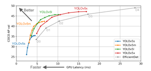

# DLIP LAB4

# 1. Subject
### Automatic key limitation measurement program when boarding rides in amusement parks.

# 2. Background
#### There are many rides in the amusement park with height restrictions. Failure to comply with height restrictions can lead to safety accidents immediately. There are many people who want to board without complying with the height limit, and it is difficult for amusement park staff to check all of them. If you can recognize a person through a camera and measure his or her height in real time while standing in line at an amusement park, it can help prevent safety accidents. In addition, if the height limit is violated, an alarm may be displayed to determine whether it is possible to board easily and quickly.

# 3. Theory
1. yolov5
#### Conventional yolov3 had higher frame per seconds (FPS), while mean average precision (mAP) was a relatively lower model. However, yolov5 outperforms both in terms of FPS and mAP. And unlike other models of the yolo, the yolov5 is divided into sizes.  Yolov5s, Yolov5m, Yolov5l, Yolov5x, which is easy to distinguish if you think of it as small, medium, large, and xlarge.  This division is the difference between depth multiple (model multiple) and width multiple (layer width multiple).
</img> 

2. Coco dataset

# 4. Process

# 5. Code

# 6. Analysis

# 7. Limit

# 8. Conclustion
