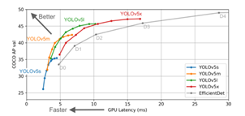

# DLIP LAB4

# 1. Subject
### Automatic key limitation measurement program when boarding rides in amusement parks.


# 2. Background
#### There are many rides in the amusement park with height restrictions. Failure to comply with height restrictions can lead to safety accidents immediately. There are many people who want to board without complying with the height limit, and it is difficult for amusement park staff to check all of them. If you can recognize a person through a camera and measure his or her height in real time while standing in line at an amusement park, it can help prevent safety accidents. In addition, if the height limit is violated, an alarm may be displayed to determine whether it is possible to board easily and quickly.


# 3. Theory
1. yolov5
#### Conventional yolov3 had higher frame per seconds (FPS), while mean average precision (mAP) was a relatively lower model. However, yolov5 outperforms both in terms of FPS and mAP. And unlike other models of the yolo, the yolov5 is divided into sizes.  Yolov5s, Yolov5m, Yolov5l, Yolov5x, which is easy to distinguish if you think of it as small, medium, large, and xlarge.  This division is the difference between depth multiple (model multiple) and width multiple (layer width multiple).
</img><br/>
#### Accuracy and speed are conflicting and cannot be caught altogether. Instead of s being the fastest, accuracy is reduced and x being the slowest, accuracy is improved. The reason why YOLOv5 is faster than the existing YOLO series is the difference between backbone and head. The Backbone part extracts Feature Map from the image, similar to yolov4. The point here is that we used CSPNet. The head part is to locate an object based on Feature Map. The Anchor Box (Default Box) is initially set up and then used to create the final bounding box. We generate bounding boxes on three scales and use three anchor boxes on each scale.

2. Coco dataset
#### We present a new dataset with the goal of advancing the state-of-the-art in object recognition by placing the question of object recognition in the context of the broader question of scene understanding. This is achieved by gathering images of complex everyday scenes containing common objects in their natural context. Objects are labeled using per-instance segmentations to aid in precise object localization. Our dataset contains photos of 91 objects types that would be easily recognizable by a 4 year old. With a total of 2.5 million labeled instances in 328k images, the creation of our dataset drew upon extensive crowd worker involvement via novel user interfaces for category detection, instance spotting and instance segmentation. We present a detailed statistical analysis of the dataset in comparison to PASCAL, ImageNet, and SUN. Finally, we provide baseline performance analysis for bounding box and segmentation detection results using a Deformable Parts Model
-	Train2017 (19G)
-	Val2017 (788M)
-	Test2017(6.3G)
-	Annotations(808M)


# 4. Process
1. Use yolov5, coco dataset
2. Detect people using person class only
3. Gets the coordinates of the bounding box
4. Replace xyxy with xywh
5. Pixel value if only 5.h is imported
6. Match it with the actual person's height
7. Show results


# 5. Code
1. Add Virtual Environment
  ```
  conda create -n test_envs python=3.8  
  ```
#### You can add a virtual environment with the command 'conda create -n' and write the desired virtual environment name immediately after it.
#### 'python= x.x' can then be used to set the python version of the virtual environment.

2. Check the list of virtual environments

  ```
  conda info --envs
  ```
  </img><br/>

#### If you look at the list again, you can see that an environment named test_envs has been added.


3. Activate Virtual Environment

  ```
  conda activate test_envs
  ```

#### Performing such as 'activate test_envs' will enable the virtual environment, and you will see that the (base) that was originally active will be replaced with (test_envs)

4. Install git

  ```
  Conda install git
  ```

5. Clone the yolov5 Github Code

  ```
  git clone https://github.com/ultralytics/yolov5.git
  ```

6. Move to yolov5 folder

  ```
  Cd yolov5
  ```

7. Use Editor

  ```
  Code .
  ```

8. Install all required libraries (requirement.txt)

  ```
  pip install -r requirements.txt
  ```

9. Modify detect.py File

   1) Find the box coordinates of objects

   ​	Specifies the permitted text and the non-permitted text. And when the desired class is found in the received image, it is the 	code that gets the coordinates for it.

   ```python
   allow_txt='Available'
   warning_txt='No rides allowed!!'
   for *xyxy, conf, cls in reversed(det):
       if save_txt:  # Write to file
           xywh = (xyxy2xywh(torch.tensor(xyxy).view(1, 4)) / gn).view(-1).tolist()  # normalized xywh
           line = (cls, *xywh, conf) if opt.save_conf else (cls, *xywh)  # label format
   
           with open(txt_path + '.txt', 'a') as f:
           f.write(('%g ' * len(line)).rstrip() % line + '\n')
   ```

   

    2)  Size calculation using curve fitting and bounding box

   * Curve Fitting

     </img>

     

     As shown in the figure above, it is possible to fit the difference between the real environment and the USB camera through secondary curve fitting. The second order curve fitting is used because the USB camera is located at the bottom. Therefore, it is difficult to represent the change according to the actual height change in a straight line. Therefore, a second-order curve fitting was used.

     

   3) Code of script

   ```python
   box_height = float(xyxy[3]-xyxy[1])
   person_height = pow(box_height,2)*0.0004099+box_height*0.2692+20.39
   print(person_height)
   ```

   $$
   xyxy[3] - xyxy[1]:{\text{the vertical size of the box}}
   $$

   $$
   person\_height = 0.0004099 \times box\_height^2  + box\_height \times 0.2692 + 20.39
   $$

   

   ```python
   if save_img or opt.save_crop or view_img:  # Add bbox to image
       c = int(cls)  # integer class{                        
       if(person_height>150):
       label = None if opt.hide_labels else (names[c] if opt.hide_conf else f'{allow_txt}--			{person_height:.2f}cm')
       plot_one_box(xyxy, im0, label=label, color=colors(34, True), line_thickness=opt.line_thickness)                            
       elif(person_height<=150):
       label = None if opt.hide_labels else (names[c] if opt.hide_conf else f'{warning_txt}--		{person_height:.2f}cm')
       plot_one_box(xyxy, im0, label=label, color=colors(31, True), line_thickness=opt.line_thickness)
       if opt.save_crop:
       save_one_box(xyxy, imc, file=save_dir / 'crops' / names[c] / f'{p.stem}.jpg', BGR=True)
   ```

   The text of the label box is output differently depending on the size of the person.

   

   ```python
   cv2.line(im0, (200,450), (640,450),(255,255,0),thickness=3)
   ```

   Code that draws the target's toe baseline.

10. Practice

  ```python
  python .\detect.py --weights .\yolov5l.pt --source 0 --view --nosave  --classes 0
  ```

11. Output

  </img><br/>

# 6. Analysis
#### It was tested on five people for verification.
##### 1. Actual height of 5 people
- 170cm 
- 174cm 
- 168cm 
- 183cm 
- 179cm

##### 2. Keys measured using the program
</img><br/>

##### 3. MSE evaluation per person
</img><br/>

##### The average value of MSE is 0.8463. The MSE evaluation method verified that the accuracy of the program is very high.

# 7. Limit
- The position of the camera and the position of the person should be fixed because depth data cannot be imported.
- There is a problem that it is not accurate when the camera position or the person position changes.
- The resolution is limited because bounding boxes are imported in pixels.

# 8. Conclustion
#### I can confirm that it measures more accurately than I thought. It can be applied to other situations besides amusement parks. The following are typical examples. It is important for 119 ambulances to quickly measure the patient's physical information such as height, weight, pulse, and blood type and send it to the hospital. Patients' exact biometric data can be sent to hospitals in a short time to increase their chances of survival. In these environments, it is expected that key measurement programs using yolov5 will be useful. If a key measurement program is applied, it will not only be available in this but also in more diverse fields.
